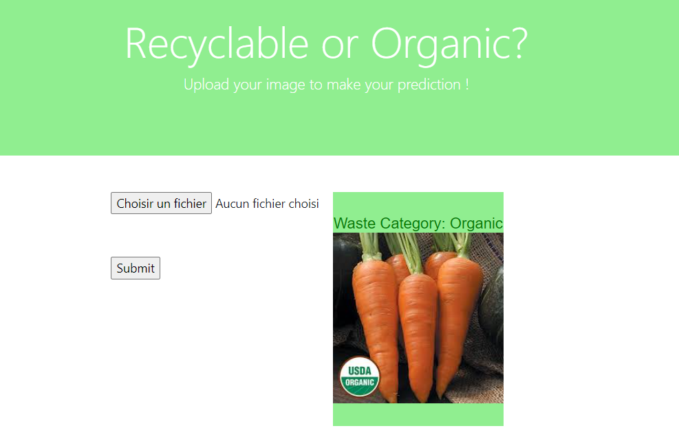

# EcoClassify : Image Recycling Classifier
#### Overview 
The application's purpose is to classify images into recyclable or organic categories.
This Flask application is designed to accept image uploads, classify them using a pre-trained Convolutional Neural Network (CNN) model, and display the results on a web page. 

Here's a brief overview of the code:

##### File Upload:
Users can upload an image through the web interface.

##### Prediction:
- The uploaded image is passed to the *predictImage* function, which uses a pre-trained CNN model (my_cnn_model.h5) to predict the class of the image.
- The model is loaded using TensorFlow's *load_model* function.
- The image is preprocessed to match the input shape expected by the model.
- The model predicts whether the image is classified as "Recyclable" or "Organic."

##### Display Results:
The prediction results (class and image) are displayed on the web page.
Flash messages are used to display the results.

##### Web Interface:
The main route (/) renders the *index.html* template, which contains the file upload form and displays the prediction results.

